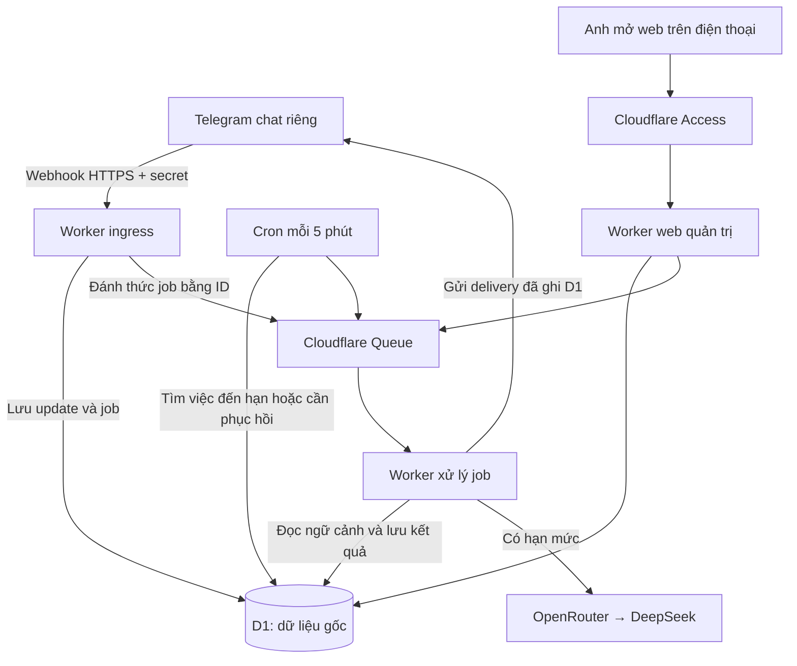

# Hạ tầng bản thử Telegram — chuẩn bị trước coding

Ngày review: 08/09/2026. Trạng thái: blueprint đề xuất, chưa provision tài nguyên, cài dependency hoặc deploy. Ràng buộc: một người dùng, Telegram, DeepSeek qua OpenRouter, mục tiêu chạy 24/7, tổng ngân sách tạm hiểu 1–2 USD/tháng.

## 1. Quyết định đề xuất

Dùng **Cloudflare Workers Free + D1 + Queues + Cron**, nhận Telegram bằng webhook. Đây là đề xuất thay cho VPS/long polling trong tài liệu trước khi biết ngân sách. Không cần mua VPS hoặc domain cho pilot cá nhân. `workers.dev` dành cho dự án cá nhân/hobby và có thể bảo vệ bằng Access; chưa phải cam kết uptime cho sản phẩm quan trọng. [Cloudflare workers.dev](https://developers.cloudflare.com/workers/configuration/routing/workers-dev/)

“24/7” ở đây nghĩa là endpoint và lịch xử lý hoạt động độc lập với laptop. Không có tiến trình Node chạy thường trực hoặc model chạy liên tục. Chặng Coding executor dài vẫn cần hạ tầng riêng sau này; pilot không chạy shell, clone repo hoặc test code trên Workers.

[So sánh hạ tầng và giá](../research/telegram-infrastructure-options.md) là bằng chứng cho lựa chọn. [Review tech stack](tech-stack-review.md) ghi phần giữ/đổi so với thiết kế cũ.

## 2. Topology

Ba entry point triển khai trong cùng repository, chia sẻ lõi TypeScript: `ingress` chỉ nhận tin; `processor` nhận queue/cron; `admin` phục vụ web/API đã xác thực. Đây là phân chia quyền và vòng đời thực thi, không phải một server cho mỗi module nghiệp vụ.

## 3. Danh mục tài nguyên

| Tài nguyên | Số lượng pilot | Vai trò / quyền |
|---|---:|---|
| Cloudflare account Free | 1 | Chủ sở hữu là anh; không tự bật plan trả phí |
| Worker ingress | 1 | Webhook; D1 + queue producer; không cần OpenRouter key |
| Worker processor | 1 | Queue consumer + scheduled handler; D1, Telegram token, OpenRouter key |
| Worker admin | 1 | Web và API nội bộ; Access một tài khoản, D1 + queue producer |
| D1 database | 1 | Task, plan, ứng tuyển, habit, inbox, job, outbox, quyền và budget |
| Queue | 1 | Chỉ chở job/delivery ID; D1 giữ payload và trạng thái |
| Cron Trigger | 1 | Mỗi 5 phút: nhắc đến hạn, phục hồi lease, gửi lại thông báo phù hợp |
| Access application | 1 | Bảo vệ toàn bộ admin worker và preview; ingress không đi qua màn hình login |
| Telegram bot | 1 cho pilot | Private chat đã liên kết; bot thử riêng nếu test từ Telegram thật |
| OpenRouter account/key | 1 | Model cấu hình được, key phía processor |

Không chia sẻ DB production với thử nghiệm local. Local dùng Wrangler mô phỏng binding; remote staging chỉ tạo khi cần smoke test, có tên/DB/bot tách riêng và không bật cron trùng.

## 4. Nhận tin và xử lý bền vững

1. Ingress giới hạn body, kiểm tra webhook secret, loại update và người gửi/private chat. Update từ tài khoản chưa liên kết chỉ được đi qua luồng pairing được giới hạn; không đọc dữ liệu hoặc gọi AI.
2. Lưu inbound event với unique key `(bot_id, update_id)` và job tương ứng bằng transaction/batch phù hợp. Chỉ trả HTTP thành công sau khi lưu bền vững. HTTP 200 xác nhận giao nhận cho Telegram, chưa phải công việc đã hoàn thành.
3. Publish ID vào queue sau commit; lỗi publish không mất job. Cron quét các job chờ chưa được xử lý và đưa lại vào queue. Hai việc D1 commit và queue publish không phải một transaction chung.
4. Consumer claim job bằng điều kiện trạng thái/lease và số thế hệ claim. Queue giao trùng thì consumer đọc D1 rồi bỏ qua việc đã xong. Kết quả từ worker mất lease không được ghi đè hoặc phát tác động mới.
5. Model chỉ trả đề xuất dữ liệu có schema. Lõi kiểm tra quyền, revision, tham chiếu và thời gian; sau đó commit thay đổi, trạng thái job và outbox cùng nhau. Không giữ transaction DB trong lúc chờ model/Telegram.
6. Gửi outbox bằng bước độc lập. Gửi Telegram lỗi không chạy lại job AI. Kết quả gửi không rõ được ghi `unknown`; không hứa exactly-once trên tác động ngoài không có idempotency.
7. Retry hữu hạn, lỗi hết retry hiện trên trang việc cần xử lý. D1 giữ việc đã thất bại; cron không tự làm mới ngân sách retry vô hạn.

Telegram hỗ trợ webhook secret và nhận update bằng webhook hoặc polling; chỉ dùng một cách. Nguồn: [Telegram setWebhook](https://core.telegram.org/bots/api#setwebhook). Queues có thể giao một tin nhiều lần; thiết kế phải chống trùng. [Queue delivery](https://developers.cloudflare.com/queues/reference/delivery-guarantees/)

### Thứ tự hội thoại

Queue không bảo đảm thứ tự. Mỗi hội thoại có sequence nội bộ và lease cho mọi lệnh thay đổi, kể cả lệnh không dùng AI. Consumer chỉ xử lý lệnh sẵn sàng sớm nhất đã lưu; job sau chờ job trước đang ảnh hưởng ngữ cảnh. Lease có fencing token và timeout để không khóa hội thoại vô hạn. Thứ tự này là thứ tự hệ thống tiếp nhận, không giả biết một tin Telegram chưa đến. Nếu tin hoàn thành đến trước tin tạo task, giữ chờ làm rõ/phụ thuộc, không tạo hoặc hoàn thành nhầm việc. Tin sửa/duyệt cũ vẫn kiểm tra revision riêng.

## 5. Transaction, đồng thời và lịch

D1 dùng prepared statements và `batch()` cho nhóm lệnh cần atomicity; không giả định transaction tương tác tùy ý như connection SQLite trên VM. Update có `WHERE revision = expected_revision`; batch cập nhật thêm event/outbox phải được ràng buộc theo cùng kết quả command, tránh phát event nếu update ảnh hưởng 0 dòng. Kiểm tra bằng test cạnh tranh thật tại interface lưu dữ liệu. [D1 batch](https://developers.cloudflare.com/d1/worker-api/d1-database/#batch)

Các index tối thiểu: unique provider update; jobs theo status/next_run_at; deliveries theo status/next_attempt_at; application theo vị trí/lần gửi; habit occurrence theo ID nguồn; plan/task revision. Không quét toàn bộ chat mỗi lần cron.

Cron là cơ chế đánh thức. Lịch thật nằm trong DB theo `next_run_at` và timezone, có unique occurrence key. Với tick 5 phút, nhắc việc có thể chậm tới một tick cộng thời gian xử lý; không cam kết đúng từng giây. Nhắc quá hạn khi phục hồi được gom/bỏ theo chính sách. Bản tin và chỉ tiêu tuần tính theo Asia/Ho_Chi_Minh mặc định đề xuất; xác nhận khi onboarding.

## 6. Hạn mức và ngân sách

Workers Free: 100.000 request/ngày, 10 ms CPU mỗi HTTP request và mỗi cron invocation; thời gian chờ mạng không tính CPU. Đây là lý do giữ ingress nhỏ, web nhẹ và xử lý theo bước. **Đo CPU trên staging là điều kiện đạt**, không giả định free tier đủ chỉ vì ít người dùng. [Workers limits](https://developers.cloudflare.com/workers/platform/limits/)

Queues Free có 10.000 operation/ngày, lưu tin 24 giờ; một tin nhỏ thường tốn ba operation trước retry. Chỉ dùng queue làm cơ chế đánh thức, không lưu trạng thái duy nhất ở đó. [Queues pricing](https://developers.cloudflare.com/queues/platform/pricing/)

Dự toán vận hành: hạ tầng 0 USD khi nằm trong free quota; phần 1–2 USD dành cho DeepSeek. Không tính gói dùng AI để phát triển code, thuế/phí thanh toán hoặc mức nạp tối thiểu chưa xác minh. Quota áp dụng trên account cần đối chiếu với các app khác. Xem bảng tính có giả định trong [nghiên cứu](../research/telegram-infrastructure-options.md).

Đề xuất cap AI mặc định 0,80 USD/tháng cho mức tổng 1 USD; có thể nâng cap tới 1,60 USD khi chọn tổng 2 USD. Reserve chi phí tối đa của một call trước khi gửi bằng cập nhật atomic; cộng usage thực sau khi có kết quả. Call timeout chưa rõ usage vẫn giữ khoản dự phòng để đối soát. Có 20% khoảng dự phòng, hạn mức theo ngày và tối đa một job AI hoạt động cho người dùng trong pilot. Đếm tổng mọi lần gọi, cả retry và bản tin.

Nhập liệu qua nút/lệnh, đếm tiến độ và nhắc lịch không cần AI. Khi hết budget, vẫn nhận/lưu việc và phục vụ lệnh xác định; phần ngôn ngữ mơ hồ ở trạng thái chờ, không tự bịa diễn giải. Hệ thống chỉ giảm gọi API, không tự nạp tiền hoặc nâng plan.

## 7. Cấu hình cần chuẩn bị

| Tên logic | Nơi dùng | Kiểu |
|---|---|---|
| `DB`, `JOBS_QUEUE` | Binding được tạo kiểu từ Wrangler | Resource binding |
| `TELEGRAM_WEBHOOK_SECRET` | Ingress | Secret |
| `TELEGRAM_BOT_TOKEN` | Processor; tác vụ setup webhook riêng | Secret |
| `OPENROUTER_API_KEY` | Processor | Secret |
| `OPENROUTER_BASE_URL` | Processor | Config: `https://openrouter.ai/api/v1` |
| `OPENROUTER_MODEL` | Processor | Config: ứng viên `deepseek/deepseek-v4-flash` |
| `MONTHLY_AI_BUDGET_USD` | Processor | Config + ledger DB; mặc định đề xuất 0,80 |
| `TIMEZONE` | Lõi/scheduler | Config: `Asia/Ho_Chi_Minh` |
| `ADMIN_ORIGIN`, Access audience/issuer | Admin | Config; định danh người dùng phải qua xác thực |
| Notification preferences | DB | Người dùng chọn trước bật nhắc |

Wrangler secrets trên cloud, file secret local được ignore. Không dùng token trong URL web/admin, prompt, log hoặc tài liệu. Chỉ ghi secret name trong config công khai. Binding types sinh từ Wrangler; không hand-write một bộ types khác. [Workers secrets](https://developers.cloudflare.com/workers/configuration/secrets/)

Pairing bắt đầu từ web đã đăng nhập: mã ngẫu nhiên một lần, hạn dùng, rate limit; lưu Telegram user/chat ID sau xác minh. Thu hồi liên kết chặn gửi/nhận và yêu cầu duyệt cũ. API admin chỉ chấp nhận identity đã xác thực (JWT hợp lệ đúng issuer/audience hoặc cơ chế Access xác thực tương đương), allowlist đúng một tài khoản; thiếu/sai identity trả 401/403 kể cả khi cấu hình Access ở dashboard bị thiếu. Không tin header email tự khai. API kiểm tra origin/CSRF cho ghi dữ liệu, không chỉ ẩn nút trên frontend. Access bảo vệ admin worker; không bảo vệ ingress bằng login vì Telegram cần gọi trực tiếp.

## 8. Quan sát, backup và phục hồi

Log chỉ request/job ID, loại lỗi, attempt, revision, token/chi phí và timing; không ghi nội dung chat, hồ sơ hoặc authorization headers. Dashboard cần thấy: webhook lỗi, job chờ lâu, cron heartbeat, delivery unknown, quota và ngân sách còn lại.

Dùng cơ chế phục hồi D1 theo plan đã xác minh cộng export riêng trước migration/phát hành; đặt bản export mã hóa ngoài repo. Trước dùng dữ liệu thật cần chọn đích backup tự động phù hợp ngân sách và thử restore sang DB khác. Đây là đầu việc chưa triển khai, không gọi Time Travel là backup độc lập. [D1 recovery](https://developers.cloudflare.com/d1/reference/time-travel/)

Mục tiêu thử đề xuất: snapshot/export hàng ngày, chấp nhận mất tối đa một ngày nếu phải dùng bản export; thời gian khôi phục phải đo trong diễn tập. Không tuyên bố đã đạt RPO/RTO. Sau restore, áp lại deletion/revocation ledger đã lưu ngoài snapshot cũ trước bật retrieval, bot và cron.

Nếu hạ tầng lỗi, xem Cloudflare dashboard độc lập với bot; thông báo lỗi trong Telegram không thay thế giám sát ngoài hệ thống. Pilot chưa có SLA. Khi free quota/CPU không đủ, giảm tải hoặc đánh giá đổi hạ tầng; không tự chuyển sang plan trả phí.

## 9. Luồng phát hành có thể kiểm chứng

Local: fake Telegram/DeepSeek + D1/Queues mô phỏng → typecheck/test → build/dry-run → staging remote với bot thử → đo CPU, retry, auth và quota → deploy pilot → kiểm tra từ điện thoại khi máy phát triển tắt.

Trước migration: export/điểm phục hồi, kiểm tra schema mới tương thích phiên bản cũ cần rollback. Rollback Worker code không rollback DB; ưu tiên migration mở rộng trước, thu hẹp sau. Khi chuyển môi trường: webhook trỏ đúng một bot/endpoint, cron cũ tắt, không dùng cùng token cho dev/pilot.

Bộ cấu hình sẽ tạo khi scaffold: `wrangler.ingress.jsonc`, `wrangler.processor.jsonc`, `wrangler.admin.jsonc`, migrations SQL, file secret mẫu không có giá trị thật, scripts check/test/build và hướng dẫn restore. Trong lượt này chỉ chốt thiết kế, chưa tạo cấu hình deploy có ID giả hoặc ứng dụng rỗng.

## 10. Kết quả rà soát blueprint

Đã rà lại bằng một agent nghiên cứu và lượt tổng hợp; đây là phản biện thiết kế, không phải kiểm thử runtime. Đã xử lý ba điểm: thống nhất cron 5 phút, thêm thứ tự mutation theo hội thoại và auth fail-closed cho admin/preview. Test bắt buộc bổ sung: queue giao lệnh tạo/hoàn thành đảo thứ tự; hai mutation một hội thoại chạy đồng thời; admin thiếu Access identity không đọc được DB.

Còn chờ trước pilot: đo CPU thực tế, tạo tài khoản/resource, thử API/Telegram thật, chọn đích backup tự động và thử restore. Các việc này không chặn scaffold local với fake adapter.

## 11. Điều chỉnh theo yêu cầu OpenRouter

Anh chọn DeepSeek qua OpenRouter, không gọi API DeepSeek trực tiếp. Endpoint chat là `https://openrouter.ai/api/v1/chat/completions`, xác thực bằng OpenRouter key. Model ứng viên `deepseek/deepseek-v4-flash`; kiểm tra lại phiên bản/endpoint hỗ trợ trước chốt, không giả đồng nhất với alias tại DeepSeek trực tiếp. [OpenRouter quickstart](https://openrouter.ai/docs/quickstart)

Giữ model cụ thể; không bật fallback sang model khác. Routing chỉ dùng provider đã kiểm tra chất lượng/quyền dữ liệu trong giới hạn giá, với `provider.max_price` và `require_parameters` phù hợp. Provider không đáp ứng thì báo chờ/lỗi, không âm thầm nới giá hoặc bỏ tham số. Reserve cost theo giá trần route được phép, không theo giá rẻ nhất trên trang. Lưu generation ID, provider thực tế, model và usage/cost để đối soát. [Provider routing](https://openrouter.ai/docs/guides/routing/provider-selection)

Dữ liệu gửi thêm qua OpenRouter và provider suy luận; kiểm tra chính sách lưu dữ liệu trước pilot cá nhân. Không suy ra mọi provider có cùng chính sách. Reasoning/schema/tool support kiểm tra theo endpoint; ẩn reasoning khỏi response không đồng nghĩa không phát sinh phí reasoning. [Reasoning](https://openrouter.ai/docs/guides/best-practices/reasoning-tokens)
